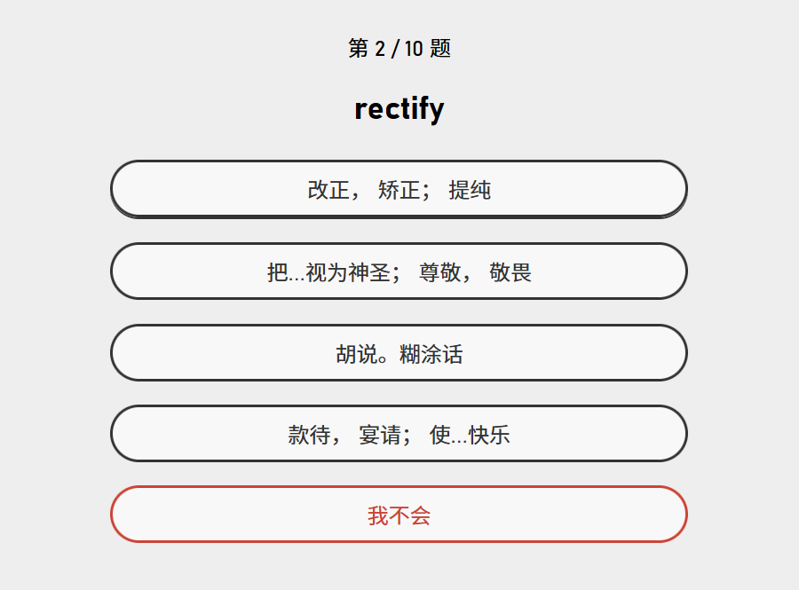

# Beidanci | 背单词

顾名思义，这是一个用来背单词的工具。

## 介绍

我很喜欢[墨墨背单词](https://www.maimemo.com/)那种训练模式：每天根据以往的训练情况与遗忘曲线生成一组训练目标，挨个过，过完了明天继续。
但是呢，这 app 用起来有两个地方很不爽：
一是它没有测验的功能，一个单词记没记住全靠自己申报，很容易下意识地就略过去了，不能完全可靠地检验我是否记住了；
二是它的规划记忆容量有上限，差不多 600 来个，每天能训练几十个词，再多了要花钱扩容。
这一个 GRE 词库三千来个词，一天 50 个要背到猴年马月去啊？背到明年都背不完。

因此，我恶向胆边生，手起刀落整了这么个工具，极简风格、开源自用、量大管饱。
它同样是回合制的刷题模式，但与墨墨相比有三点不同：

1. 它支持测验式的训练，每出现一个词生成若干选项，只有选对了才算过关。
	这可以确保你记住了而不是无意识划过。
2. 它的题组不限频率、不限量。
	你尽管坐在那里刷上一天，算法会任劳任怨地按照遗忘曲线给你推送最有效的题组。
3. 你可以自由配置题组的“激进程度”：设置得越激进，题组中就会出现越多的新单词；反之算法就会更注重巩固薄弱词汇。

<figure style="text-align: center;">
	
	
	<figcaption>墨墨所采用的自我申报式训练，与本工具额外支持的测验式训练。</figcaption>
</figure>

## 安装与使用

这是一个前后端分离的 web app。
你可以把它下载到本地在 PC 上运行，或者部署到自己的服务器上。
在未来（v0.2.0 时）计划发布更易用的 electron 包装版本，但不是现在。
目前只支持在 Windows 上运行。

要安装这个 app，首先将本 repo 下载到本地。
然后，在 repo 根目录里执行 `make install` 以安装依赖。
如果你的设备无法使用 `GNU Make`，也可以分别在 `backend`、`frontend` 两个目录里执行 `npm i`。

安装完成后，可以在 repo 根目录里执行 `make run` 运行，然后用浏览器打开 `http://localhost:8543` 使用。
如果没有 `GNU Make`，可以在 `backend` 中执行 `npm run start`，并在 `frontend` 中执行 `npm run dev`。

<figure style="text-align: center;">
	
	
	<figcaption>运行后看到的 app 首页与设置页。</figcaption>
</figure>

## 词库与用户数据

您可以在设置页导入 CSV 格式的词库，内容格式为：两列、无表头，第一列为词汇在源语言中的正字，第二列为中文翻译。

一切词库与用户数据储存于 `%APPDATA%/Roaming/Nianyi Wang/Beidanci/` 中。

## 开发与反馈

若欲直接参与开发，您可以直接对此 [GitHub repo](https://github.com/WangNianyi2001/Beidanci) 提出 PR，或联系[我](https://github.com/WangNianyi2001)加入开发成员列表。

如果您在使用中遇到了任何问题，或者有对新功能的需求或建议，欢迎在 [Issue 页](https://github.com/WangNianyi2001/Beidanci/issues)提出！
不过，我不保证一定会回复。（笑）